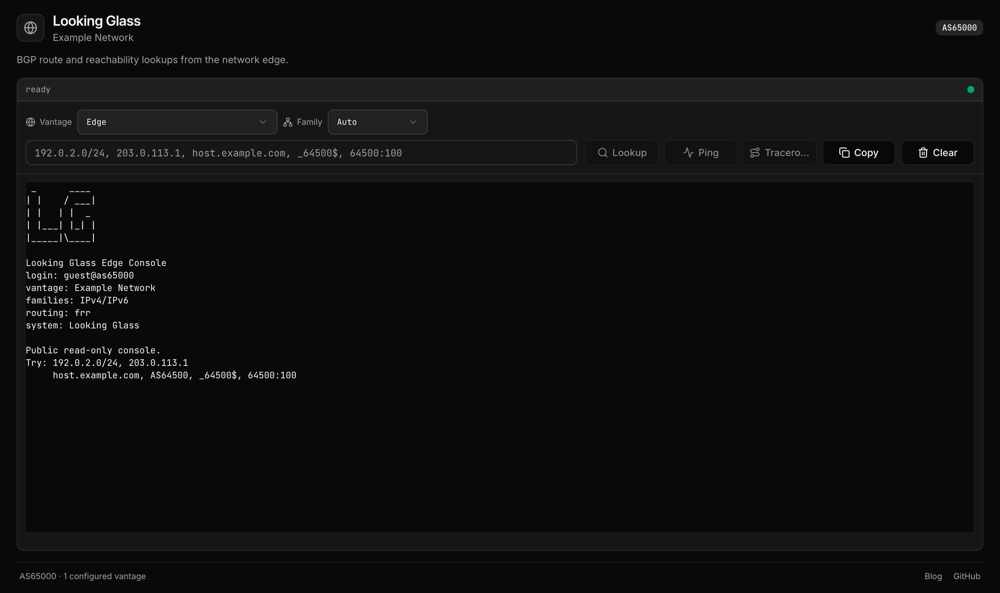

# Looking Glass

A self-hostable **AS looking glass**: a sleek web UI for querying one network's
edge view — BGP RIB lookups plus live `ping` / `traceroute` — from a single
vantage point on a router or Linux host.



BGP table queries are the headline feature (that's what makes it a *looking
glass* and not just a ping page). All public traffic stays on Cloudflare's edge;
the router only ever runs a small, allow-listed command wrapper.

```
Browser ─▶ React Router v7 SSR (Cloudflare Worker, edge)
              │ loader fetch + CF-Access service-token headers
              ▼
         CF Access (service-token policy) — public can't reach the API
              ▼
         Cloudflare Tunnel ──◀── cloudflared (outbound 443/QUIC; NO inbound ports)
              ▼
         command wrapper @ 127.0.0.1  (router / Linux host)
              │ argv exec (never a shell string)
              ▼
         vtysh or birdc / ping / traceroute   (local RIB = ms)
```

## Repository layout

| Path                 | What it is |
|----------------------|------------|
| `wrapper/`           | Go HTTP API in front of `vtysh` or `birdc`, plus `ping` / `traceroute`. Single static binary, zero dependencies. |
| `frontend/`          | React Router v7 (SSR) app. Deploys to Cloudflare Workers (default) or Node (adapter). UI built with Tailwind v4 + shadcn/ui. |
| `frontend/server/`   | Node/Express adapter — the second, optional runtime for the frontend. |
| `frontend/app/lib/ghostty/` | Ghostty VT bindings plus a generated WebAssembly terminal parser used client-side to render command output on canvas. |
| `deploy/cloudflared/`| Example `cloudflared` tunnel config for the wrapper host. |
| `deploy/github-actions/` | Opt-in deploy workflow **template** (not wired by default). |

## How it works

- The wrapper exposes `GET /healthz`, `POST /api/bgp`, `GET /api/ping`, and
  `GET /api/traceroute`.
- BGP queries are fast request/response calls suitable for the page loader.
- `ping` and `traceroute` stream line-by-line as Server-Sent Events through
  client-side resource routes, so long probes never block SSR.
- The frontend renders output through a generated `libghostty-vt` WASM module
  that parses ANSI/VT sequences into terminal cells. The wire/API contract stays
  plain text and SSE; the WASM renderer is a replaceable presentation layer.
- The Ghostty pin is intentionally fixed. The generated `.wasm` is gitignored;
  CI rebuilds it and runs binding smoke tests on every push and pull request.

---

## Quick start (local, no infrastructure)

Run the whole UI on your laptop against a **stub wrapper** that returns canned,
RFC-range output — no router, no Cloudflare, no real data.

```sh
# 1. Build the Ghostty terminal WASM (uses Docker; gitignored artifact)
./scripts/build-ghostty-vt.sh

# 2. Frontend deps
cd frontend && npm install

# 3. Point the app at the stub and start the stub
cp .dev.vars.example .dev.vars
#   then edit .dev.vars so it contains:  LG_API_BASE_URL=http://127.0.0.1:8088
node scripts/stub-wrapper.mjs            # stub wrapper on 127.0.0.1:8088

# 4. In another shell: run the dev server
cd frontend && npm run dev               # http://localhost:5173
```

You now have BGP lookups, ping, and traceroute rendering end-to-end with fake
data. `.dev.vars` is the single local config file (see
[Configuration](#configuration)).

---

## Develop against a real wrapper (dev/testing only)

Sometimes you want the UI to hit a **real** wrapper on a real vantage host — to
see real RIB output — without standing up the whole Cloudflare path. The wrapper
binds loopback by default and the box opens no inbound ports, so to reach it
off-box you must **explicitly override the bind** and reach it over a trusted
network.

> ⚠️ **Dev/testing only — never production.** Loopback binding is the wrapper's
> *entire* local security boundary; there is no application-layer auth. A
> non-loopback bind puts an unauthenticated command endpoint on the network.
> Only do this across a trusted overlay you control (e.g. a WireGuard tunnel or
> a private lab LAN), never on a public interface. In production the wrapper
> sits on `127.0.0.1` and only `cloudflared` reaches it.

On the vantage host, run the wrapper with the unsafe override:

```sh
# binds a non-loopback address; REFUSED unless the override is set
LG_LISTEN_ADDR=[::1]:8080            # example: loopback (safe, default)
LG_LISTEN_ADDR=[fd00:dev::2]:8080    # example: a WireGuard ULA you control
LG_UNSAFE_NON_LOOPBACK=1 LG_LISTEN_ADDR=[fd00:dev::2]:8080 ./wrapper
```

Then point the frontend straight at it and set the same unsafe override so the
frontend runtime is allowed to call a non-loopback origin without CF Access
headers. The wrapper still has no client auth:

```sh
# in frontend/.dev.vars
LG_API_BASE_URL=http://[fd00:dev::2]:8080
LG_UNSAFE_NON_LOOPBACK=1

cd frontend && npm run dev      # or: npm run build:node && npm run start:node
```

The browser still only talks to your local dev server; the dev server (loader +
resource routes) is what reaches the wrapper over your overlay. Bound the probes
with the wrapper's `LG_*` limits (see [`wrapper/.env.example`](wrapper/.env.example)).

---

## Deploy your own

Production has three parts: the **vantage side** (wrapper + cloudflared), the
**Cloudflare side** (Access + tunnel + service token), and **deploying the
Worker** (locally or via the CI template).

### 1. Vantage side — wrapper + cloudflared

Install the wrapper on the box that has the local BGP RIB, keep it bound to
loopback behind the mandatory local HAProxy concurrency gate, and run
`cloudflared` on that same host so the tunnel forwards to HAProxy at
`http://127.0.0.1:8080`. Pick the guide that matches your routing daemon:

| Platform | BGP backend | Setup guide |
|----------|-------------|-------------|
| VyOS router with FRR | `LG_ROUTING_BACKEND=frr`, `vtysh` | [`docs/router-vyos-frr.md`](docs/router-vyos-frr.md) |
| Ubuntu host with BIRD2 | `LG_ROUTING_BACKEND=bird`, `birdc -r` | [`docs/router-ubuntu-bird2.md`](docs/router-ubuntu-bird2.md) |

Both guides cover wrapper installation, service persistence, loopback firewall
rules, the HAProxy `maxconn` gate, and `cloudflared` placement. The full wrapper
config surface is in
[`wrapper/.env.example`](wrapper/.env.example). If you use the BIRD backend, set
`LG_ROUTING_BACKEND=bird` on the Worker too so the UI shows BIRD path-mask
syntax instead of FRR AS-path regex examples.

### 2. Cloudflare side — Access, tunnel, service token

Do this in the Cloudflare dashboard / `cloudflared` CLI for the zone that will
host your looking glass:

1. **Create the tunnel** and route a hostname for the wrapper origin to it:
   ```sh
   cloudflared tunnel create <name>
   cloudflared tunnel route dns <name> lg-api.example.com
   ```
   Put the resulting tunnel UUID + credentials file into the `cloudflared`
   config on the vantage host, using the platform guide from step 1.
   > Tip: keep the wrapper-origin hostname **one label deep** under your zone
   > (`lg-api.example.com`, not `lg.api.example.com`) so free Universal SSL
   > (`*.example.com`) covers it; two-deep needs paid Total TLS/ACM.
2. **Create an Access service token** (Zero Trust → Access → Service Auth).
   Save the Client ID and Client Secret — these become the Worker's
   `CF_ACCESS_CLIENT_ID` / `CF_ACCESS_CLIENT_SECRET`.
3. **Add a self-hosted Access application** for the wrapper-origin hostname with
   a **Service Auth** policy that *includes only that service token*. This is
   what blocks the public from the API: only your Worker, which sends the token,
   gets past Access. Everything else gets a 403 at the edge.

   > **Required for backend security:** the deployed Worker must have both
   > `CF_ACCESS_CLIENT_ID` and `CF_ACCESS_CLIENT_SECRET` set. Without these
   > secrets, the Worker cannot authenticate through Cloudflare Access to the
   > wrapper-origin hostname. Do not weaken or bypass the Access policy to "make
   > it work" — that would expose the backend command API to the public edge.
   > This is intentional: the wrapper stays dumb and unauthenticated; Cloudflare
   > Access is the authentication boundary.
4. **Add edge hardening rules** for public traffic: challenge only the frontend
   HTML shell, and rate-limit the backend command API as a courtesy throttle so
   obvious bursts usually return `429` before reaching the tunnel. This is not
   DoS protection; HAProxy `maxconn` is the hard cap. See
   [`docs/cloudflare-hardening.md`](docs/cloudflare-hardening.md) for the exact
   Cloudflare rules, Free-plan constraints, and Rulesets API examples.
5. **API token for deploying** (Account → API Tokens). Scope it tightly:
   - Account → *Workers Scripts* → **Edit**
   - Account → *Account Settings* → **Read**
   - For a custom domain also: Zone → *Workers Routes* → **Edit**, Zone → *DNS*
     → **Edit**, Zone → *Zone* → **Read**

   You'll use this as `CLOUDFLARE_API_TOKEN` (with `CLOUDFLARE_ACCOUNT_ID`) to
   deploy, locally or from CI.

### 3. Deploy the Worker

**Option A — locally (default).** Deploys run from a trusted machine, so no
Cloudflare token sits in GitHub.

```sh
cd frontend
# one-time: real, non-secret vars + custom domain go in a GITIGNORED prod config.
#   Copy the committed placeholder and edit it:
cp wrangler.json wrangler.prod.jsonc       # then set real LG_* vars + a `routes` entry
# one-time: set the Worker secrets (persist across deploys)
npx wrangler secret put CF_ACCESS_CLIENT_ID
npx wrangler secret put CF_ACCESS_CLIENT_SECRET

# Do not skip these secrets: they are what lets the Worker reach the
# Access-protected backend API without making that API public.

# authenticate wrangler: `npx wrangler login`,
#   or export CLOUDFLARE_API_TOKEN + CLOUDFLARE_ACCOUNT_ID
cd ..
scripts/deploy.sh            # builds the WASM (Docker) + builds + deploys
scripts/deploy.sh --dry-run  # validate without uploading
```

`scripts/deploy.sh` auto-detects `frontend/wrangler.prod.jsonc` and bakes its
vars/routes into the deployed config; without it, the committed placeholder
`wrangler.json` is used. `wrangler.prod.jsonc` is gitignored — it's where your
real values live.

**Option B — GitHub Actions (opt-in template).** A ready-to-use deploy workflow
ships as a **template that is intentionally not wired**:
[`deploy/github-actions/deploy.yml.template`](deploy/github-actions/deploy.yml.template).
GitHub only runs workflows under `.github/workflows/`, so this file never runs
until you copy it in:

```sh
cp deploy/github-actions/deploy.yml.template .github/workflows/deploy.yml
```

It builds the WASM (Zig, self-fetched), generates the prod wrangler config from
your **repository Variables**, and deploys. Set these under *Settings → Secrets
and variables → Actions*:

- **Secrets:** `CLOUDFLARE_API_TOKEN` (scoped as in step 2.4),
  `CLOUDFLARE_ACCOUNT_ID`.
- **Variables** (non-secret, replace the repo's placeholders): `LG_WORKER_NAME`,
  `LG_ROUTE` (public hostname; omit for `*.workers.dev`), `LG_API_BASE_URL`,
  `LG_AS_NUMBER`, `LG_SITE_TITLE`, `LG_OPERATOR_NAME`, `LG_SITE_URL`,
  `LG_ADDRESS_FAMILIES`, `LG_ENABLED_QUERIES`, `LG_ROUTING_BACKEND`, and optional
  `LG_SITE_DESCRIPTION` / `LG_REPO_URL` / `LG_BLOG_URL` / `LG_VANTAGE_POINTS`.
- The Worker **secrets** (`CF_ACCESS_CLIENT_ID` / `CF_ACCESS_CLIENT_SECRET`)
  persist on the Worker, so set them once with `wrangler secret put` (the
  workflow has a commented step if you'd rather push them from CI).

The template defaults to **manual** dispatch (`workflow_dispatch`); flip on the
`push:` trigger only once you trust your branch protections — a CI deploy means
anyone who can change a workflow can reach your Cloudflare token.

> **Why ship it unwired?** A public repo with a live deploy token is a standing
> risk (malicious PRs, token exfiltration). Local deploys are the safe default;
> the template is there when you've decided CI deploys are worth wiring.

---

## Configuration

The frontend reads one config shape (`LookingGlassEnv`) regardless of runtime;
each runtime adapter fills it from its own source:

| Where you run | Source of config | Secrets |
|---------------|------------------|---------|
| **Worker, prod** (`wrangler deploy`) | `vars` in `wrangler.prod.jsonc` (gitignored) | `wrangler secret put` |
| **Worker, local** (`npm run dev`) | `vars` in `wrangler.json` + **`.dev.vars`** (overrides) | `.dev.vars` |
| **Node** (`npm run start:node`) | host `process.env` | host env |

**Local secret source is centralized:** the Node adapter loads `frontend/.dev.vars`
— the same gitignored file `wrangler dev` reads — on startup, so one file
configures both local runtimes. Real process env always wins over the file, and
in production the file is absent (gitignored, never deployed), so the load is a
no-op. **Precedence, highest first:** real `process.env` → `.dev.vars` (Node);
`--var` flag → `.dev.vars` → `wrangler.json vars` (Worker local). Your shell's
env reaches the Node adapter but **never** the Worker.

### Run on Node instead of Cloudflare (optional)

Nothing under `frontend/app/` is Cloudflare-specific — the runtime is a thin
adapter. A Node/Express adapter (`frontend/server/index.js`) is included as a
second proven runtime, handy if you'd rather self-host the frontend next to the
wrapper.

```sh
cd frontend
npm run build:node     # DEPLOY_TARGET=node — emits a Node server at build/server/index.js
npm run start:node     # serves on PORT (default 3000); config from process.env / .dev.vars
```

The default `npm run build` / `scripts/deploy.sh` (Cloudflare) are unchanged;
the Node path is opt-in via `DEPLOY_TARGET=node` and its extra dependencies never
enter the Worker bundle. Note a Node host can only reach a wrapper it can route
to directly (a Worker can only `fetch()` public HTTPS).

### Multiple vantage points (optional)

Expose more than one edge by setting `LG_VANTAGE_POINTS` to a JSON object
mapping a display label to that vantage's origin API base URL:

```json
{ "Fremont, CA": "https://lg-uswest.example.com", "Amsterdam, NL": "https://lg-eu.example.com" }
```

A picker appears when two or more are configured, and each query/probe is proxied
to the selected origin. The origin URLs stay **server-side** — the browser only
receives the labels and sends back the chosen one, which the Worker resolves
against this allow-list. Every origin must accept the same Cloudflare Access
service token. When unset, the single `LG_API_BASE_URL` is used.

---

## Security model

The wrapper sits in front of shell-outs, so **command injection is the entire
threat model**. The design holds to:

1. **argv, never a shell.** Commands are built as argv arrays and run with
   `exec.CommandContext` — no `sh -c`, no string interpolation.
2. **Allow-list every input.** Query type is a closed enum; a prefix must parse
   as a valid IP/CIDR; AS-path/community values pass strict charset checks; probe
   targets must be public IP literals or strict hostnames that resolve
   server-side to public IPs before they can reach a command. Hostnames with any
   private, loopback, link-local, multicast, documentation, or other special
   resolved address are rejected rather than selecting a public record from a
   mixed answer set.
3. **Fixed command set.** FRR `show bgp …` or BIRD `show route …`, AS-path
   queries, community queries, `ping`, and `traceroute` — nothing builds
   arbitrary commands.
4. **Run unprivileged.** The wrapper's OS user has only the routing-daemon access
   it needs: `frrvty` for FRR / `vtysh`, or the BIRD control-socket group for
   `birdc -r`. `ping`/`traceroute` are already setuid / `cap_net_raw`. The
   wrapper **refuses to start as uid 0**.
5. **Loopback binding is the boundary.** The wrapper **refuses to start** on a
   non-loopback address unless the explicit `LG_UNSAFE_NON_LOOPBACK=1` override
   is set (dev/testing on a trusted overlay only). There is **no app-layer client
   auth** — loopback is the local boundary.
6. **Edge auth at Cloudflare Access.** The Worker authenticates *past CF Access*
   to the tunnel with a service token; the public only ever touches the Worker.
   The wrapper never inspects the token — Access validates it at the edge. If
   `CF_ACCESS_CLIENT_ID` / `CF_ACCESS_CLIENT_SECRET` are missing in production,
   fix the Worker secrets or Access policy; do **not** make the wrapper-origin
   hostname public to compensate.
7. **HAProxy maxconn is the hard cap.** Every production vantage runs local
   HAProxy on loopback in front of the wrapper. The HAProxy backend `maxconn` is
   the real DoS bound for concurrent origin pressure; the wrapper intentionally
   does not implement its own global concurrency policy.
8. **Cloudflare rate limiting is a courtesy throttle.** The Free-plan rule in
   [`docs/cloudflare-hardening.md`](docs/cloudflare-hardening.md) can reduce
   obvious bursts before they reach the tunnel, but it is per Cloudflare colo and
   source IP, not a global cap.

Long-running probes never block SSR: the page loader handles only the page and
fast BGP queries, while `ping`/`traceroute` stream to the browser as Server-Sent
Events via dedicated resource routes.

## Development

```sh
# wrapper
cd wrapper && go test ./... && go vet ./... && go build ./cmd/wrapper

# frontend
cd frontend && npm run typecheck && npm run build
```

The Ghostty VT WebAssembly artifact is generated and gitignored. Build it locally
with Docker (avoids macOS host SDK linker issues):

```sh
./scripts/build-ghostty-vt.sh            # local (Docker)
./scripts/build-ghostty-vt-ubuntu.sh     # CI / Ubuntu-native (self-fetches Zig)
```

The opt-in deploy workflow template at
[`deploy/github-actions/deploy.yml.template`](deploy/github-actions/deploy.yml.template)
builds the Ghostty WASM and frontend before deploy. It is intentionally not
wired by default; local checks above remain the baseline before publishing.

## License

[MIT](./LICENSE).
